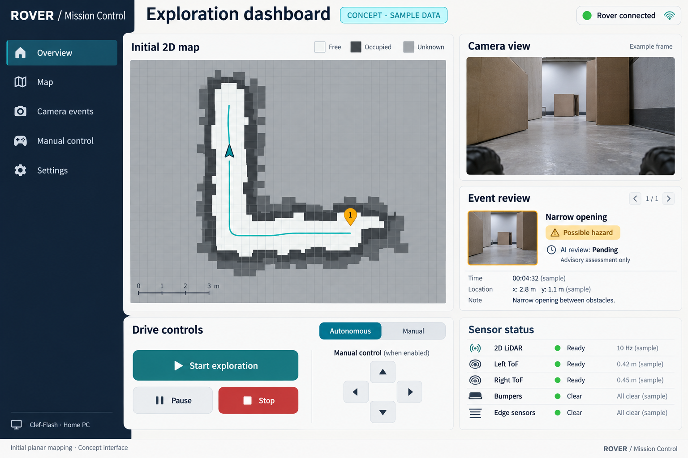

<!-- Synced from the current native Google Doc on 7 October 2026. Google Docs remains authoritative; this is a repository text snapshot. -->

אורט עירוני ד מודיעין

# הצעת פרויקט

## רכב רובוטי לניווט, מיפוי וניתוח תמונות

שם הפרויקט: רכב רובוטי לסריקה, מיפוי ותיעוד מפגעים באזורים מסוכנים

פרויקט זוגי   |   5 יח״ל   |   האינטרנט של הדברים

המחשה רעיונית של המערכת המתוכננת

## מטרת הפרויקט

מטרת הפרויקט היא סריקה ומיפוי של אזורים מסוכנים, זיהוי מפגעים אפשריים וסיוע באיסוף מידע לצורכי חילוץ ומודיעין, תוך צמצום הצורך בכניסת אדם לאזור. נבנה אב טיפוס שינוע בזירת ניסוי, יציג מפה ותמונות למפעיל ויאפשר שליטה מרחוק.

## פרטי ההגשה

| שדה | פרטים |
| --- | --- |
| שם הפרויקט הסופי | רכב רובוטי לסריקה, מיפוי ותיעוד מפגעים באזורים מסוכנים |
| נושא שנתי | האינטרנט של הדברים (IoT) |
| סמל שאלון | 841589: עבודת גמר, 5 יח״ל |
| תלמיד א׳ | יותם משה |
| תלמיד ב׳ | עילי וינטר |
| מנחה | מאיר קיסוס |
| שנת הלימודים | תשפ״ז |

## תקציר

בפרויקט נבנה אב טיפוס של רכב רובוטי שיוכל לנסוע באופן עצמאי בזירת ניסוי מוגדרת, לזהות מכשולים וליצור מפה ראשונית בשני ממדים באמצעות 2D LiDAR. חיישני ToF בצד שמאל ובצד ימין יסייעו בשמירת מרחק ממכשולים, וחיישני מגע וקצה משטח יפעילו עצירה מקומית בעת הצורך. המשתמש יוכל לראות בטלפון את המפה, את נתיב הנסיעה ואת מצב הרכב, להפעיל ולעצור אותו ולעבור לשליטה ידנית.

בשלב הראשון נתמקד בנסיעה עצמאית ובמיפוי ראשוני. בהמשך נשמור תמונות או קטעי וידאו כשיעלה חשד למפגע, ונקשר אותם למיקום המשוער במפה. ניתוח התמונות יעזור להציג למשתמש מפגעים אפשריים ומקרים שבהם אין מספיק מידע. הניתוח ישמש להכוונה בלבד ולא יקבע אם המקום בטוח למעבר בני אדם.

המיפוי יתאר את הסביבה במישור שבו הרכב נוסע.

המחשה רעיונית של מיקום החיישנים: LiDAR, חיישני ToF צדדיים, מצלמת ESP CAM S3 וחיישני מגע וקצה משטח.

## תיאור הבעיה או הצורך

משימות חילוץ וסריקה במקומות צרים או בתוואי שטח לא ידוע מחייבות איסוף מידע לפני כניסת צוותים. מכשולים, חסימות וראות מוגבלת מקשים על הבנת הסביבה ועל בחירת דרך גישה. כניסה לצורך בדיקה ראשונית עלולה לחשוף את הצוות לסיכון.

המערכת מיועדת לתת למפעיל תמונת מצב ראשונית מרחוק: מפה מישורית, נתיב נסיעה ותיעוד חזותי של מפגעים אפשריים. המשתמשים המיועדים הם מפעילים המסייעים לצוותי חילוץ וסריקה. בפרויקט נדגים את היכולת בזירה מבוקרת המדמה מסדרון צר, חסימות ומכשולים; לא נבצע ניסויים באזור מסוכן בפועל.

### סקר פתרונות חלופיים לצורכי סריקה וחילוץ

| חלופה | יכולת מרכזית | מגבלה ביחס לתכנון |
| --- | --- | --- |
| רכב נשלט מרחוק עם מצלמה | תיעוד חזותי מרחוק לפני כניסת צוות | דורש הכוונה רציפה; ללא מפה אוטומטית |
| רכב עם הימנעות ממכשולים | סריקה בסיסית עם תגובה למכשולים | אין קישור מובנה בין המכשול, מיקומו ותיעודו |
| רכב עם מיפוי ותיעוד | מפה ותיעוד מפגעים לפי מיקום משוער | מורכבות גבוהה יותר; דיוק תלוי בחיישנים ובכיול |

## תפקיד הפרויקט

המערכת תקבל פקודות מהמשתמש ותאסוף נתוני תנועה, מדידות מרחק ותמונות. בתכנון הנוכחי Raspberry Pi שעל הרכב יבנה מפה ראשונית ויחליט כיצד הרכב ינוע. בטלפון ובמחשב הנייד נציג את המידע ונאפשר למשתמש לשלוט ברכב.

### מבנה המערכת המוצע

מערכת ההנעה תכלול בקר ESP, שני מנועים עם מקודדים ודרייבר מנועים מתאים. הבקר יקרא את חיישני ToF הצדדיים, חיישני המגע וחיישני קצה המשטח, יווסת את מהירות הגלגלים ויעצור בעת זיהוי מגע, קצה משטח או אובדן פקודות. Raspberry Pi ישמש כמחשב שעל הרכב ויקבל את נתוני התנועה והמרחק. חיישן 2D LiDAR יחובר אליו דרך USB וישמש למיפוי ולזיהוי מכשולים במישור הסריקה, כולל לפני הרכב. יחידת ESP CAM S3 תהיה נפרדת מבקר ההנעה ותעביר תמונות ל Raspberry Pi דרך WiFi.

Raspberry Pi יעריך את מיקום הרכב, יעדכן את המפה, יתעד תמונות ויפעיל את שירות הממשק. המחשב הנייד ישמש להפעלה, לפיתוח ולבדיקות. את התמונות ננתח במחשב הביתי באמצעות Clef Flash Q8_0 של Cloudflare. המודל מקבל תמונות ומחזיר החלטות עם הסתברויות. התאמת החומרה במחשב הביתי כבר נבדקה, ובהמשך נבדוק את תוצאות המודל על תמונות שנאסוף בפרויקט.

### אופן הפעולה והאלגוריתמים

המשתמש יבחר מצב עבודה ויפעיל את הרכב. מכונת מצבים תנהל נסיעה, הימנעות ממכשולים, שליטה ידנית ומצב תקלה. בקרת PI/PID תשתמש במשוב מהמקודדים לוויסות מהירות הגלגלים. אודומטריה בשילוב IMU תשמש להערכת מיקום הרכב וכיוונו. מדידות 2D LiDAR יעדכנו מפה המחולקת לתאים: שטח פנוי, מכשול ושטח לא ידוע. חיישני ToF השמאלי והימני יספקו מדידות צדדיות לשמירת מרווח ולהשלמת המידע. נסנן מדידות רועשות ונתעלם מנתונים ישנים או לא תקינים. זיהוי מכשול בנתיב יוביל להאטה, עצירה או שינוי מסלול. אובדן סריקות LiDAR תקפות יוביל לעצירת הנסיעה העצמאית. חיישני מגע וקצה משטח יפעילו עצירה בבקר ESP ללא תלות בניתוח התמונות.

כשיעלה חשד למפגע, נשמור תיעוד עם זמן ומיקום משוער ונשלח אותו לניתוח. התוצאה תוצג כחשד למפגע, ללא מפגע שזוהה או לא ידוע. הסתברויות המודל אינן הוכחה לבטיחות המקום. לאחר שנצליח לבנות מפה שימושית, נבחן תכנון מסלול באמצעות A*. בשלב הראשון לא נתחייב למיפוי SLAM מלא.

### חלוקת עבודה ותקשורת

יותם משה יוביל את בקר ESP, ההנעה, חיישני המרחק והמשוב מהמקודדים. עילי וינטר יוביל את Raspberry Pi, שילוב מצלמת ESP CAM S3, המיפוי ושירות ניתוח התמונות. נעבוד יחד על ממשק המשתמש, שילוב המערכות והבדיקות. שני התלמידים יכירו את כל חלקי הפרויקט.

המערכת מחולקת למערכת הנעה המבוססת על ESP ולמערכת מיפוי ותיעוד המבוססת על Raspberry Pi. ESP יקרא מקודדים, IMU, חיישני ToF שמאלי וימני, חיישני מגע וחיישני קצה משטח ויפעיל מנועים. Raspberry Pi יקבל סריקות 2D LiDAR ותמונות מ ESP CAM S3, יחשב מפה וישלח פקודות תנועה. נשתמש ב I2C לחיישנים המתאימים, בקלטים דיגיטליים לחיישני המגע והקצה וב UART דרך USB בין ESP ל Raspberry Pi. LiDAR יעביר נתונים דרך USB, הצילום דרך WiFi והממשק באמצעות WebSocket.

## תרשים מלבני

המערכת כוללת ESP להנעה ולעצירה מקומית, Raspberry Pi לניווט ולמיפוי, 2D LiDAR לסריקת מרחק, ESP CAM S3 לצילום ומחשב ביתי לניתוח תמונות. נתוני LiDAR יועברו ל Raspberry Pi דרך USB. חיישני ToF שמאלי וימני, חיישני המגע וחיישני קצה המשטח יחוברו ל ESP. חלוקת החיישנים והחיבורים המעודכנת מפורטת בטבלה ובתיאור הרכיבים.

### המערכת המתוכננת: קלט, פעולה ופלט

| מלבן | קלט | פעולה ופלט |
| --- | --- | --- |
| ממשק בטלפון | פקודות משתמש ומידע מהמחשב | הצגת מפה, מצב ואירועים; פקודות שליטה |
| Raspberry Pi | סריקות LiDAR, נתוני תנועה, תמונות ופקודות | הערכת מיקום, מפה ופקודות תנועה |
| בקר ESP | פקודות, מקודדים, IMU, ToF, חיישני מגע וקצה | בקרת מנועים, משוב ועצירה בעת מגע או קצה |
| מערכת צילום: ESP CAM S3 | תמונות ופקודות לכידה | צילום והעברת תמונות ל Raspberry Pi דרך WiFi |
| מחשב ביתי / AI | תמונות והקשר האירוע | סיווג מייעץ והסתברויות |
| אספקת חשמל | אנרגיה מסוללה | מתחים וזרמים לרכיבי הרובוט |

## רשימת רכיבים מוצעת

רכיבי הליבה כוללים בקר הנעה ESP, מחשב Raspberry Pi, יחידת צילום ESP CAM S3, חיישן 2D LiDAR אחד, שני מנועים עם מקודדים, שני חיישני ToF בצד שמאל ובצד ימין, חיישן IMU, חיישני מגע וחיישני קצה משטח. בחירת הדגמים תתבסס על טווח המדידה, קצב הדגימה, מספר החיבורים, ממשקי התקשורת וצריכת החשמל.

| רכיב / קבוצה | כמות מתוכננת | תפקיד |
| --- | --- | --- |
| בקר ESP | 1 | בקרת הנעה, משוב ותקשורת |
| Raspberry Pi | 1 | קליטת תמונות, מיפוי, ניווט ושירות הממשק |
| ESP CAM S3 | 1 | צילום והעברת תמונות ל Raspberry Pi |
| מנועי DC עם מקודדים | 2 | הנעה ומשוב מהירות ותנועה |
| דרייברים, שלדה וגלגלים | מערכת אחת | הפעלת המנועים ונשיאת הציוד |
| חיישני מרחק ToF: שמאלי וימני | 2 | שמירת מרווח צדדי וזיהוי מכשולים סמוכים |
| חיישן IMU לכיוון ולתנועה | 1 | שיפור הערכת הכיוון |
| 2D LiDAR | 1 | סריקת מרחק, מיפוי וזיהוי מכשולים; USB ל Raspberry Pi |
| חיישני מגע / פגושים | 2: קדמי ואחורי | זיהוי פגיעה ועצירה מקומית ב ESP |
| חיישני קצה משטח | 4: סמוך לפינות השלדה | זיהוי אובדן קרקע ועצירה לפני נפילה |
| סוללה, הגנות וממירי מתח | 1 | אספקת חשמל יציבה |
| מחשב נייד ומחשב ביתי | 1 מכל סוג | הפעלה ובדיקות בנייד; ניתוח תמונות במחשב הביתי |
| טלפון, רשת ורכיבי תקשורת | 1 | ממשק, העברת נתונים וחיבור אינטרנט |

### תפקידי החיישנים והסיבה לבחירתם

חיישני ToF יותקנו בצד שמאל ובצד ימין וימדדו את המרחק לקירות ולמכשולים לצד הרכב. הם יסייעו בשמירת מרווח משני הצדדים, במעבר במסדרון צר ובזיהוי מכשולים צדדיים סמוכים. חיישני ToF מספקים מדידת מרחק ישירה המבוססת על זמן מעבר האור. החיישן הקדמי מועבר לצד ימין משום ש 2D LiDAR יספק את מדידות המרחק לפני הרכב במישור הסריקה. כך שני חיישני ToF נותנים כיסוי צדדי מאוזן. יכולת הזיהוי בפועל תלויה בגובה ההתקנה, בטווח ובשטחים המתים של החיישנים; מכשולים שאינם חוצים את מישור LiDAR עשויים שלא להיראות בסריקה.

שני המקודדים, אחד לכל מנוע, ימדדו את סיבובי הגלגלים. הנתונים ישמשו לבקרת מהירות באמצעות PI/PID ולהערכת המרחק שהרכב עבר. ההפרש בין תנועות הגלגלים ישמש להערכת הפנייה. מקודדים מודדים את סיבוב הגלגל ולא את תנועת הרכב ביחס לקרקע, ולכן החלקה עלולה לגרום לשגיאת מיקום.

חיישן IMU יספק מדידות של מהירות הסיבוב ושל התאוצה. הג׳ירוסקופ יסייע בהערכת שינוי הכיוון ובשילוב עם המקודדים ישפר את הערכת הפניות. מדידות התאוצה יוכלו לסייע בזיהוי תנועה חריגה. ה IMU אינו מספק מיקום מוחלט, וגם בו מצטברת שגיאה לאורך זמן.

חיישני מגע יותקנו בחזית ובחלק האחורי של הרכב ויזהו פגיעה פיזית במכשול. הם יספקו שכבת גיבוי כאשר מכשול לא זוהה במדידות המרחק ויפעילו עצירה מקומית ב ESP. הם אינם מונעים את המגע הראשוני, אלא מגבילים את המשך התנועה לאחריו.

ארבעה חיישני קצה משטח יותקנו סמוך לפינות השלדה ויופנו כלפי הקרקע. הם יזהו אובדן קרקע מתחת למסלול הגלגלים, למשל לפני מדרגה או שפת משטח, ויפעילו עצירה מקומית לפני שהגלגל מגיע לקצה. מיקומם ומהירות הנסיעה יותאמו למרחק העצירה. חיישנים אלה נדרשים משום ש LiDAR סורק במישור אופקי ואינו מבטיח זיהוי של נפילה מתחת לרכב. הם ישמשו להגנה מפני נפילה ולא למפת גובה.

ניטור זרם המנועים ומתח הסוללה הוא הרחבה אפשרית לזיהוי עומס, תקיעה או התרוקנות הסוללה.

מצלמת ESP CAM S3 תספק מידע חזותי לצפייה מרחוק, לתיעוד אירועים ולניתוח מפגעים במחשב הביתי. Raspberry Pi יקבל את התמונות דרך WiFi, ישמור אותן ויקשר אותן למיקום המשוער במפה. המצלמה מאפשרת לזהות את מראה המכשול, אך אינה מספקת לבדה מדידת מרחק מכוילת.

חיישן 2D LiDAR אחד הוא רכיב ליבה במערכת. הוא יספק מדידות מרחק בזוויות רבות במישור לצורך בניית המפה וזיהוי מכשולים סביב הרכב, כולל בנתיב הנסיעה. מדידותיו יועברו ל Raspberry Pi דרך USB וישולבו עם הערכת המיקום מהמקודדים ומה IMU. טווחי המדידה והשטחים המתים ייבדקו לאחר ההתקנה. מערכת ההנעה תפעיל דרייבר לשני המנועים, ויחידת החשמל תספק מתח מתאים באמצעות סוללה, הגנות וממירי מתח.

יישום האינטרנט יפעל על Raspberry Pi ויציג מפה, מצב ותמונות בדפדפן של הטלפון או המחשב הנייד. מחשב נייד אחד ישמש להפעלה ולבדיקות, ומחשב ביתי אחד ינתח תמונות וישיב ציוני מודל.

### בדיקת המערכת

נבדוק תחילה את ההנעה, 2D LiDAR, שני חיישני ToF הצדדיים, IMU, המקודדים, חיישני המגע, חיישני קצה המשטח, ESP CAM S3 והתקשורת בנפרד. לאחר מכן נשלב נסיעה ומיפוי בזירה עם מסלול צר, חסימה ושטח פנוי. נבדוק שמירת מרווח משני הצדדים וזיהוי מכשולים לפני הרכב באמצעות LiDAR. נשווה את המפה למידות הזירה ואת מיקום האירועים למיקומם בפועל. בדיקות קצה משטח יבוצעו על משטח נמוך עם אבטחה מכנית מפני נפילה. נבדוק עצירה בעת הפעלת חיישן מגע או קצה, אובדן סריקות LiDAR, אובדן תקשורת וכשל בשירות הניתוח. נתעד שגיאת מיקום, מרחק וזמן עצירה וזמני צילום וניתוח. יעדי הבדיקה המתוכננים הם חמש הרצות ללא התנגשות, עצירה בתוך שנייה מאובדן פקודות ושגיאת מיקום ממוצעת של עד 30 ס״מ בזירה קטנה.

## ניתוח תמונות באמצעות בינה מלאכותית

### המודל וההרצה המקומית

נשתמש במודל Clef Flash של Cloudflare בגרסת Q8_0 לניתוח התמונות. לפי התכנון הקיים זהו מודל הכולל כ 9 מיליארד פרמטרים, שמקבל תמונה והקשר לצד שאלות עם אפשרויות תשובה מוגדרות ומחזיר הסתברויות לאפשרויות האלה. קטגוריות הניתוח הראשוניות יהיו חסימת מעבר, מכשול בנתיב, פתח צר ואיכות תמונה שאינה מאפשרת הכרעה. נבדוק את התאמתן לתמונות מזירת הניסוי.

המודל ירוץ במחשב הביתי, שהחומרה שלו כבר נבדקה, ולא על בקר ESP. Raspberry Pi יטפל בניווט ובמיפוי ויפנה לשירות הניתוח. מודל הבינה המלאכותית לא ירוץ עליו בתכנון הנוכחי. למימוש המקומי נבחן llama.cpp בגרסה התומכת במודל ובממשק /v1/systemone. קובץ Q8_0 הוא בנפח של כ 9.68 GB, ונדרש גם קובץ mmproj לעיבוד התמונות. נפח הקובץ אינו זהה לצריכת הזיכרון בזמן הרצה.

### מהצילום ועד לסימון במפה

כאשר חיישן יזהה מצב חשוד או המשתמש יסמן אירוע, יחידת ESP CAM S3 תספק תמונה לתיעוד. Raspberry Pi יקבל אותה וישמור מזהה אירוע, זמן, מיקום משוער וסיבת צילום. בהמשך נבחן שמירת קטע וידאו קצר וזיהוי חזותי אוטומטי, בהתאם ליכולת המצלמה ולרוחב הפס. Raspberry Pi ישלח תמונות נבחרות לשירות הניתוח במחשב הביתי דרך חיבור רשת עם אימות, כדי שלא נצטרך לנתח כל פריים.

נגדיר שאלות על מפגעים הנראים בתמונה, למשל חסימה או פתח צר, וגם שאלה על איכות התמונה. התוצאה תוצג בטלפון ליד האירוע במפה: חשד למפגע, ללא מפגע שזוהה או לא ידוע. המשתמש יוכל לפתוח את התמונה ואת ציוני המודל. התוצאה, גרסת המודל וזמן העיבוד יישמרו יחד עם האירוע.

בקשה לניתוח תעבוד ברקע ותסומן כממתינה עד לקבלת תשובה. אם התמונה חשוכה או מטושטשת, התשובה אינה מספקת או השירות אינו זמין, נציג מצב לא ידוע. הנהיגה והעצירה המקומית לא ימתינו לניתוח. המודל נותן הכוונה לגבי מה שנראה בתמונה, ואינו מאשר שהמקום בטוח לבני אדם.

### תקשורת ובדיקת התוצאות

נתוני התנועה והפקודות יועברו בין בקר ESP ל Raspberry Pi דרך UART בממשק USB, עם חותמות זמן ובדיקת תוקף הפקודות. ESP CAM S3 תעביר תמונות דרך WiFi. הטלפון והמחשב הנייד יתחברו לממשק דרך WiFi ו WebSocket. Raspberry Pi יעביר תמונות ונתוני אירועים דרך האינטרנט לשירות ניתוח מאומת במחשב הביתי באמצעות HTTPS ויקבל את תוצאותיו. נבדוק העברת נתונים בין רשתות, אימות גישה והתנהגות המערכת בזמן ניתוק.

נכין תמונות מזירת הניסוי ונסמן מראש את המפגעים ואת המקרים שאינם ברורים. נבדוק זיהויים נכונים, מפגעים שהוחמצו, התרעות שגויות וזמן תגובה, וגם ניתוק רשת וכשל בשירות. נבחר ספי החלטה לפי הבדיקות, ולא נניח שציוני המודל הם הסתברויות בטיחות מוכחות. תהליך השילוב והשימוש בבינה מלאכותית יתועד בספר הפרויקט.

מקורות: [תיעוד המודל של Cloudflare](https://huggingface.co/Cloudflare/clef-flash). [תיעוד גרסת GGUF וההרצה המקומית](https://huggingface.co/bartowski/Cloudflare_clef-flash-GGUF).

## קונספט חזותי ליישום האינטרנט

המחשה רעיונית של ממשק הסיור והמיפוי. הנתונים והתמונות באיור הם דוגמאות בלבד.

יישום האינטרנט יפעל על Raspberry Pi ויציג מפה ראשונית בשני ממדים, נתיב, מיקום משוער, תמונות ואירועים. המשתמש יוכל לבחור נסיעה עצמאית או שליטה ידנית, להפעיל, להשהות ולעצור. נציג מצב חיישנים וחיבור ומצב בקשות ניתוח במחשב הביתי. ציוני המודל ישמשו להערכה מייעצת. ההדמיה נוצרה בכלי יצירת תמונות ואינה מערכת שפועלת בפועל.
